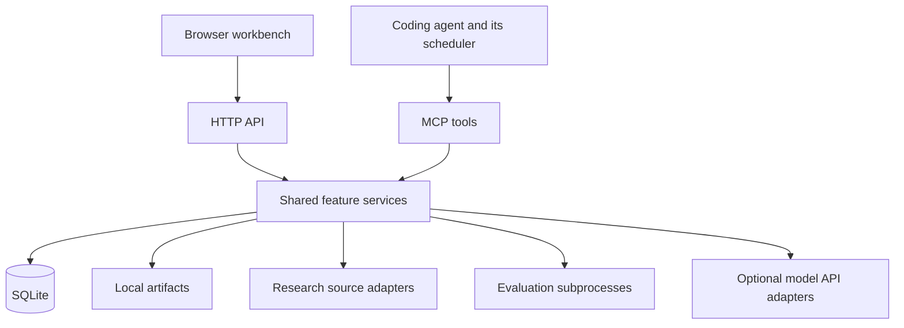

# Paperloop — Technical Design

Status: accepted initial v1 design; application implementation follows separately.

This document translates the [functional scope](PRODUCT_SCOPE.md) into a maintainable local architecture. Feature extensibility is the main architectural concern. Scaling across large numbers of users is not a v1 requirement.

## 1. Architecture and stack

Use a modular monolith: one locally running application with clearly separated feature modules. The browser UI and coding agents use the same application services, state, and evaluation harness.

| Area | Choice | Reason |
| --- | --- | --- |
| Language | TypeScript with strict checking | Shared types across the UI, backend, and MCP |
| Runtime | Node.js 24 LTS | Supported runtime with mature subprocess and filesystem tooling |
| UI | React, Vite, React Router | An interactive local workbench without server rendering |
| Components | Tailwind CSS and shadcn/ui using Radix | Customizable, accessible foundations |
| UI data | TanStack Query | Fetching, caching, and background status updates |
| Backend | Fastify | HTTP routes, validation hooks, logging, and static asset serving |
| Contracts | Zod | Runtime validation and shared TypeScript types |
| Storage | SQLite, better-sqlite3, Drizzle | Local persistence with typed queries and explicit migrations |
| MCP | Official TypeScript SDK | Standard protocol support without a custom implementation |
| Tests | Vitest and Playwright | Service, integration, and browser coverage |
| Workspace | pnpm workspaces | Simple package organization without additional build orchestration |

Use stable package releases, commit the lockfile, and review dependency updates deliberately. Node 24 is the selected LTS line for this design. Drizzle supports better-sqlite3, and shadcn documents Vite integration. [Node releases](https://nodejs.org/en/about/previous-releases), [Drizzle SQLite support](https://orm.drizzle.team/docs/sqlite/get-started-sqlite), [shadcn Vite setup](https://ui.shadcn.com/docs/installation/vite)

Support macOS, Linux, and WSL initially. Distribute a Node application containing the compiled UI, started through `paperloop start`. Native Windows and desktop packaging are deferred. Python, Git, and other project-specific tools are needed only for workflows that use them; evaluations can run in any language available on the machine.

The start command runs the local service, validates configuration and storage, applies compatible migrations after backup, performs recovery, and prints the workbench URL. The UI, API, MCP endpoint, and dispatcher share that service. Closing a browser tab does not stop it; stopping the service stops local scheduling and dispatch. Only one service instance may own a data directory at a time.

This design does not need separate backend deployments, Redis, a vector database, or a workflow platform. The existing coding agent provides reasoning and implementation. Paperloop provides durable context, workflow rules, research access, and evaluation execution.

## 2. Code organization and persistence

### Workspace and feature boundaries

Use three workspace packages:

| Package | Responsibility |
| --- | --- |
| `apps/web` | React workbench, API client, routes, feature views, and UI primitives |
| `apps/server` | CLI, Fastify server, MCP tools, application services, persistence, jobs, and integrations |
| `packages/contracts` | Zod schemas, shared data types, error codes, and versioned evaluation result contracts |

Keep the CLI inside the server package. Shared contracts must not import server code or expose database internals to the browser.

Organize server code by feature: projects, research, evaluations, experiments, and schedules. Each feature owns its application operations, queries, and validation. Keep related code together instead of dividing the entire application into global controller, service, and repository folders.

HTTP routes and MCP handlers validate transport inputs, call application operations, and format responses. Approval checks, claims, state transitions, and comparison logic belong to the application services, so both entry points enforce the same behavior.

Use small interfaces at real integration boundaries: research sources, model providers, repository access, and evaluation execution. Pass dependencies explicitly when composing the application. Avoid a generic plugin framework, dependency-injection container, universal repository abstraction, or separate service per feature.

### Stored records

| Records | Responsibility |
| --- | --- |
| Projects and context snapshots | Goals, constraints, local/GitHub references, context provenance, and revisions |
| Sources and collections | Source definitions, collection membership, and per-project selections |
| Documents and recommendations | Canonical source identity, extracted content references, source versions, project relevance, and saved/dismissed/tested history |
| Evaluation plans and approvals | Immutable plan versions, criteria, dataset references, invocation configuration, and the exact version approved |
| Experiments and runs | Implementation briefs, baseline/candidate references, execution state, evaluation records, and result provenance |
| Comparisons and artifacts | Compared run IDs, criteria version, computed outcomes, logs, and artifact references |
| Schedules, jobs, and claims | Intended cadence, driver, handoff status, occurrences, progress, ownership, and recovery information |
| Activity history | User and agent actions needed to explain what happened; not an event-sourced replacement for current state |

Use relational columns and constraints for identity, relationships, and state. Use validated JSON for variable metadata and metric payloads. References from completed runs must retain the evaluation and context versions that were used.

SQLite stores structured state. A configurable local data directory stores the database, extracted documents, logs, and run artifacts. Store artifact references in the database rather than large binary payloads. Keep credentials separately from project records and exclude their values from logs, tool responses, and exports.

Enable foreign keys and WAL mode. Use short transactions for related state changes and claim acquisition; never hold a transaction during a network request or subprocess execution. Add SQLite full-text search for the document library. WAL storage must remain on the same machine rather than a network filesystem. [SQLite WAL documentation](https://sqlite.org/wal.html)

### Migrations and durability

Commit versioned, reviewed migrations generated through Drizzle. Do not use automatic schema push against users' databases. Back up existing databases before migration using a SQLite-consistent backup operation rather than copying only the main file while WAL writes are active.

Record the schema version and refuse startup if the database is newer than the application understands. A failed migration must leave an actionable error and preserve the backup. Keep migration and restore procedures covered by integration tests.

Write result artifacts completely before attaching them to a completed run. If the process stops before completion, retain the run as interrupted or incomplete instead of treating a partial result file as success.

## 3. Shared interfaces and execution

### HTTP API and workbench

Expose a versioned JSON API under `/api/v1`. Share request and response schemas with the frontend, while keeping persistence models private to the server. Use consistent structured errors containing a machine-readable code and a useful message.

Long operations return a job or run ID. The UI polls active work through TanStack Query, slows or stops polling when work is terminal or the view is inactive, and refreshes affected queries after mutations. Start with polling; introduce streaming only if the interaction requires it.

Fastify serves the compiled frontend from the same origin as the API. During development, Vite proxies API requests to the backend. Store project selection, tabs, and shareable filters in routes or query parameters; store presentation preferences locally.

The approved workbench journey is connect a project → discover relevant research → start a contextual experiment → inspect evidence. Keep five project routes: `overview`, `research`, `experiments`, `schedules`, and `settings`. Research discovery is first class. Evaluation is a secondary capability within Experiments; paper import is tertiary within Research. Create experiments from contextual research/project actions; the Experiments tab displays work and evidence.

| Existing destination | New home and compatibility mapping |
| --- | --- |
| Sources (`/sources`) | Research source controls (`/research?view=sources`) |
| Library (`/library`, Research `view=library`) | Saved research within Research (`/research?view=library`) |
| Evaluation plans (`/evaluations`, `/evaluation-plans`) | Evaluation within Experiments (`/experiments?view=evaluation`) |
| Agent & API (`/agent-api`, prior `/settings`) | Settings (`/settings?view=agent-api`) |

Use replacement redirects for retired routes and preserve query parameters such as paper and experiment identities. Keep URL state for selected items and focused secondary views. Compatibility query names and API paths remain stable; they do not imply separate navigation destinations. Migrate existing features into these homes before the detailed section redesigns; do not remove working approval or execution operations during that transition.

Keep inference in project/research/evaluation services, sharing validated results through HTTP and MCP. Repository metadata/files and existing context can suggest objectives, constraints, research questions, source choices, and evaluation suites. Record source references, context version/revision, capture time, and uncertainty. Show editable summaries and ask only for missing information that blocks the next action. Metadata extraction should accept broad paper input, preserve provenance, and expose unresolved or failed extraction honestly.

Inference never grants repository access, approves a command, establishes a client connection, enables paid calls, or supplies measured results. User confirmation remains necessary for repository selection/access, exact Evaluation version and fingerprints, spending activation/bounds, and automation rules. A local checkout is required only for execution; GitHub context uses locally authorized credentials and creates no Paperloop accounts. Missing API keys leave deterministic discovery/ingestion, saved state, agent handoffs, approved local execution, and comparison rendering available. Analysis or drafting waits for an agent or explicitly enabled provider when reasoning is required.

Use `components/AutoTextarea` for multiline input: grow and shrink to the content, cap long drafts with internal scrolling, and recalculate wrapping on width changes. Disable browser resize handles. Research uses a labeled compound composer, and paper context opens `/experiments?view=prepare&paper=<id>` for deliberate preparation. Keep browser/history state for library filters and pagination. Creation and configuration use focused dialogs, including schedule edit and explicit removal confirmation. Nested dialogs contain focus independently and return to the parent action.

Build shared accessible dialogs, fields, state messages, section headings, and focused action patterns under `apps/web/src/components`; keep feature compositions in their existing project/research/experiment/schedule boundaries. Use restrained surfaces, whitespace, soft shadows, readable typography, visible keyboard focus, and progressive disclosure. Dialogs must label their purpose, contain focus, dismiss by Escape and deliberate backdrop interaction, and restore focus to their trigger. Advanced controls and provenance are secondary. Give Overview, Research, Experiments, Schedules, and Settings specific layouts and state designs, reviewed with populated desktop/narrow fixtures. Comparison results are a first-class view. Clearly represent pending agent work, pending approval, interrupted runs, incomplete evidence, unavailable sources, and missing keys without implying execution.

An action requiring agent reasoning creates persistent work and exposes the corresponding agent instructions. If no agent or enabled API-backed analysis is available, show that the work is waiting. The UI must not imply that an MCP connection alone can cause an idle agent to execute it.

### MCP interface

Serve Streamable HTTP at `/mcp` using the official TypeScript SDK. Clients connect to the same running service and share its database and job queue. Initial integration recipes cover Codex and Claude Code. [MCP TypeScript SDK](https://ts.sdk.modelcontextprotocol.io/v2/api/%40modelcontextprotocol/server/)

Expose focused tool families with explicit project, document, experiment, schedule, job, and run IDs:

| Family | Operations |
| --- | --- |
| Projects | Create, inspect, update context, and register repository references |
| Research | Search, ingest a paper, read extracted content, and save structured recommendations |
| Sources | List collections and update project selections |
| Evaluations | Draft/register plans, inspect approval state, start approved runs, and submit external results |
| Experiments | Implement a supplied paper, list/claim work, report progress, compare runs, and request cancellation |
| Schedules | Configure, inspect, pause, prepare an agent scheduling handoff, and record its reported outcome |
| Jobs | Inspect status, retrieve logs, and report structured outputs |

Define schemas in the contracts package and return structured outputs, including actionable blocking conditions when prerequisites are missing. Use bounded, paginated responses for document content, logs, and lists.

`implement_paper` accepts a project and a supplied paper reference or stored document. It prepares or resumes an experiment and returns its implementation brief, required approvals, and next actions. It does not launch another coding agent.

Persist work independently of MCP sessions. Reconnecting a client must not lose an experiment or grant it another agent's claim. Claims and progress updates identify the owning execution attempt; repeated submissions must not create duplicate runs or overwrite another attempt's results.

Approval is an application operation exposed through the local UI. MCP tools can draft plans and inspect approval status, but an execution request cannot approve its own prerequisites. User-approved automation rules authorize only work within their recorded bounds.

### Research pipeline

Start with arXiv search, RSS/Atom feeds, and direct URLs. Store source collection definitions as data so adding a collection does not require a new workflow. Each source adapter owns fetching, pagination, rate-limit handling, and conversion into a shared document representation.

Search historical papers through arXiv. Blog coverage consists of available feed history, previously indexed content, and submitted links; do not promise a complete historical web index. [arXiv API](https://info.arxiv.org/help/api/user-manual.html)

Normalize identifiers and URLs, retain source versions and retrieval timestamps, and deduplicate before analysis. Keep one source document identity separate from each project's recommendation and dismissal state. Use SQLite full-text search for the locally indexed library.

Extract article text with Mozilla Readability and text PDFs with PDF.js. Record whether extraction is complete, partial, unavailable, or failed. Preserve citations and source references. Scanned PDFs without extractable text do not imply OCR support. [Readability](https://github.com/mozilla/readability), [PDF.js](https://mozilla.github.io/pdf.js/examples/)

The usual flow is: fetch candidates → normalize and deduplicate → extract relevant content → let the agent assess applicability → validate and save recommendations. Recommendations must identify supporting documents and distinguish source claims from project measurements.

Agents normally perform relevance analysis and evaluation drafting, submitting schema-validated outputs. Optional OpenAI and Anthropic adapters provide the same analysis and drafting capabilities through user-configured models. Keep provider SDK code within those adapters. API-backed analysis does not implement code, approve evaluations, or decide measured outcomes.

Search and ingestion remain usable without a model API key. If no reasoning executor is available, store fetched material and leave analysis pending. Send external providers only the context needed for the requested operation, and expose the selected execution mode to the user.

### Evaluation harness and comparison

Use a framework-neutral command runner. Each approved evaluation configuration specifies an executable, argument array, working directory, environment-variable references, timeout, and result location. Existing suites can use a small wrapper to emit the result contract; Paperloop does not require a particular framework or programming language.

Execute without implicit shell interpretation. Capture stdout, stderr, exit status, timestamps, and artifacts. Use a subprocess group so cancellation and timeout handling can stop spawned child processes on the supported Unix platforms. A cancellation request remains pending until execution has actually stopped or is reported as uncertain.

Define a versioned JSON result contract with metric names, finite numeric values, units, optional samples, and artifact references. Success thresholds and metric direction belong to the approved evaluation plan, not to untrusted result claims. Malformed output, missing required metrics, or command failure must not produce a successful outcome.

Paperloop independently records code revision or content identity, evaluation configuration version, dataset identity, relevant environment/model settings, and result producer. Distinguish harness-run results from externally submitted agent results; imported results retain their declared provenance and are not represented as independently rerun.

Use Git worktrees for repository experiments, preserving the user's existing checkout and uncommitted work. For directories without Git, require an explicitly prepared isolated copy and record a content manifest. A GitHub context connection alone does not create a local execution environment.

Before running and comparing, verify that the evaluation configuration and cases still match the approved versions. Evaluation changes require renewed approval and a comparable baseline. The baseline and candidate may differ in implementation, but must use compatible measurement conditions.

Compute outcomes deterministically in application code from the approved criteria. Keep execution status separate from outcome: improvement, regression, no meaningful change, or inconclusive. Report raw baseline/candidate values and deltas; percentage changes are undefined when their baseline is zero. Do not infer statistical significance from a single noisy measurement. Incompatible conditions, missing evidence, or unmet sample requirements yield an inconclusive comparison with an explanation.

## 4. Agent scheduling, recovery, and local boundaries

### Native-agent scheduling

The coding agent's native scheduler is the default driver. Paperloop stores the intended cadence and timezone, generates the task instructions, records an external task reference when available, and tracks actual check-ins. Default research cadence is daily, with weekly, scan-now, and pause controls.

A scheduling handoff tells the agent to configure its native scheduler and report the outcome. Until that report arrives, show `setup pending`. Distinguish agent-reported setup from observed execution. Do not edit private agent configuration files or claim a schedule was installed merely because instructions were generated.

Scheduled instructions identify the Paperloop project and schedule, acquire due work through MCP, perform analysis or eligible experiments, and report progress and results. The agent checks current approval, pause, and automation settings on every occurrence rather than treating the original prompt as permanent authorization.

Codex local scheduling depends on the desktop environment remaining available. Claude Code desktop scheduling and session-based `/loop` have different lifetimes. Integration recipes must explain those differences and identify the selected scheduling mechanism. A remote scheduler cannot be assumed to reach a loopback-only Paperloop installation. [Codex scheduled tasks](https://learn.chatgpt.com/docs/automations?surface=app), [Claude Code scheduling](https://code.claude.com/docs/en/scheduled-tasks)

Changing or pausing a schedule in Paperloop immediately changes which work it will accept. Where an external task also needs updating or removal, return a new handoff and show that external synchronization is pending. Old or paused callbacks must not dispatch work.

### API-backed fallback

Provide an explicitly enabled local API-backed mode for research analysis and drafting. Configuring a key alone does not enable paid background work. The user selects this mode for a schedule or a manual operation; v1 does not silently switch to a paid provider after a missed agent check-in.

The local dispatcher can run that analysis while the Paperloop service is available. It can also run approved evaluations once code and inputs are ready. Implementation continues to wait for a coding agent. Reuse the same job records, output validation, and artifact handling across drivers.

### Jobs and recovery

Use a SQLite jobs table and an in-process dispatcher. Persist schedule occurrences with unique identities so agent callbacks, local execution, and retries cannot independently create duplicate work for the same occurrence. Coalesce missed occurrences into one catch-up run when the configured driver becomes available; restarting Paperloop does not itself wake an external agent.

Acquire claims and enforce concurrency limits transactionally. Default to one active implementation experiment per project. Record claim ownership and progress/check-in information. An expired claim is evidence to reconcile, not permission to blindly rerun side effects.

On restart, recover pending jobs and mark uncertain in-flight work interrupted. An interrupted run may have left a subprocess or working copy behind; reconciliation must establish its actual state before another attempt begins. Never act on a saved PID alone as proof of process identity.

Retry transient research requests with bounded backoff and respect provider retry guidance. Implementation and evaluation retries require reconciliation and a distinct recorded attempt. Pausing prevents new dispatches; already-running work remains visible and can receive a cancellation request.

Keep structured logs and activity records keyed by project, job, experiment, and run IDs. These records support diagnostics without requiring an external observability service.

### Local access and execution boundaries

Bind to loopback and validate Host and Origin. Use an automatically generated local connection secret, stored with restrictive permissions, without introducing user accounts. The CLI provisions access for the browser and agent client configurations. Keep credentials out of ordinary URLs and logs; browser access should use a local session established by the launcher rather than exposing the MCP secret in frontend assets.

Separate UI approval operations from MCP execution capabilities. Share the underlying policy checks, but do not expose an approval operation as an unrestricted execution tool. This is a local user trust boundary, not protection against an attacker already controlling the user's machine. The MCP transport specification calls for local binding and Origin validation. [MCP transport requirements](https://modelcontextprotocol.io/specification/2025-11-25/basic/transports)

Evaluations run with the local user's permissions. Worktrees isolate changes, not operating-system access. Execute only approved configurations, keep model credentials out of evaluation environments unless explicitly configured, and restrict artifact retrieval to registered locations.

Treat fetched papers and articles as data. Do not execute embedded instructions. Render extracted content without active scripts, apply fetch size/time limits, and prevent public-source fetching from becoming unrestricted access to local services. Provider secrets must remain within their intended integrations.

## 5. Validation and delivery sequence

### Implementation milestones

| Milestone | Deliverable and exit condition |
| --- | --- |
| 1. Foundation | Local startup, storage migrations, project management, the UI shell, and MCP connectivity work against the same project state. |
| 2. Complete experiment loop | A user submits a paper, approves an evaluation, establishes a baseline, has an agent implement a candidate, and inspects a supported comparison. |
| 3. Discovery | Collections, source ingestion, search, extraction, deduplication, and agent-produced recommendations work across multiple projects. |
| 4. Scheduling | Native-agent handoffs, actual check-ins, recovery, automation rules, and explicitly enabled API-backed analysis work without duplicate dispatch. |
| 5. Workbench polish | Persistent navigation, progress and failure states, evidence comparisons, integration recipes, and installation diagnostics are ready for regular use. |

### Test strategy

Use Vitest for service rules and integration tests with temporary SQLite databases. Use real subprocess fixtures for execution, malformed output, failure, timeout, and cancellation. Test transport behavior with an actual MCP client and browser workflows with Playwright.

Keep automated tests independent of paid model calls. Use recorded, sanitized provider fixtures and separate opt-in integration checks for live services. Run automated checks on Linux and macOS and maintain a WSL installation and execution smoke check.

Required scenarios include:

- Fresh installation, persistence across restart, migration backup, failed migration, and incompatible schema detection.
- Equivalent application behavior through HTTP and MCP, including approval enforcement and malformed requests.
- Source selection, partial extraction, duplicate documents, preserved dismissals, rate limits, and source failures.
- Agent-reported scheduling setup, missing check-ins, updated handoffs, paused callbacks, missed occurrences, and duplicate callbacks from different drivers.
- Concurrent claim attempts, project execution limits, expired claims, uncertain subprocess state, and safe recovery without duplicate side effects.
- Invalid result contracts, failed commands, changed evaluation cases, incompatible datasets, missing metrics, zero baselines, cancellation, and inconclusive results.
- Local connection validation, credential redaction, and artifact path restrictions.
- A complete experiment using a Python evaluation to prove language independence.

Maintainability checks should demonstrate that adding a research source is contained within its adapter and configuration, and that adding a metric supported by the result contract does not require changing HTTP routes or MCP orchestration.

### Design boundaries

This document defines the initial architecture and behavior. Exact tool field schemas and database columns should be implemented within these boundaries as each milestone is built; they do not require a new framework or architecture phase.

Keep accounts, team collaboration, hosted execution, unattended coding-agent launchers, automatic merges, and public multi-user hosting outside v1. Revisit streaming, embeddings, desktop packaging, or a separate worker only when a concrete feature or measured limitation justifies them.

The current deliverable is this technical design document and the corresponding functional-scope alignment. No application scaffold, dependency installation, or runtime implementation is part of this documentation change.
